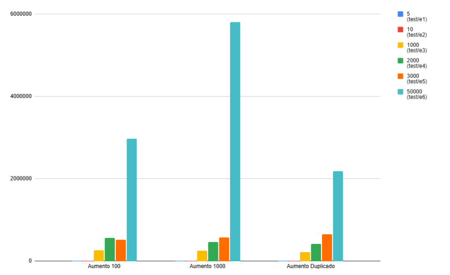

# Projeto de Algoritmos
> O objetivo desse projeto é implementar biblioteca de classes para manipulação de um vetor dinâmico de números inteiros. Sendo elas duas classes distintas, uma implementada com alocação dinâmica de arrays, realocando mais memória, quando necessário, e outra implementada com lista duplamente ligada.

Tópicos presente neste documento:
 1. [Estrutura do projeto](#struct)
 2. [Resultado dos testes realizados](#result)
 3. [Como realizar testes](#tests)
 4. [Métodos Implementados](#method)
 5. [ArrayList](#Array)
 6. [LinkedList](#Linked)
 

*******
<div id='struct'/>  

## Estrutura do projeto:  
O projeto está separado em dois diretórios de classes diferentes: ArrayList baseado em arrays dinâmicos e LinkedList baseado em nós interligados. O ArrayList possui três formas distintas de aumento de array implementadas:

1. Capacidade inicial de 100 (cem) e aumento de 100 cada vez que precisar de mais -> "array_list1.hpp"
2. Capacidade inicial de 1000 (mil) e aumento de 1000 cada vez que precisar de mais -> "array_list2.hpp" 
3. Capacidade inicial de 8 (oito) e aumento de duplica cada vez que precisar de mais -> "array_list3.hpp" 

Dentro de cada diretório está localizado os casos testes utilizados, pastas contendo o arquivo-main utilizado para o teste de cada método implementado, assim como também um arquivo.txt contendo o resultado dos testes realizados.
Seguindo a seguinte organização:


``` php
    ArrayList/
    |__ tests-nome-do-método
        |__ test-nome-do-método-array-list-01.cpp
        |__ test-nome-do-método-array-list-02.cpp
        |__ test-nome-do-método-array-list-03.cpp
        |__ resultado-tests.txt
    |__ tests
    |__ array_list1.hpp
    |__ array_list2.hpp
    |__ array_list3.hpp

    LinkedList/
    |__ tests-nome-do-método
        |__ test-nome-do-método-linked-list-01.cpp
        |__ resultado-tests.txt
    |__ tests
    |__ linked_list1.hpp
  
```

*******
<div id='result'/>  

## Resultado dos testes realizados:

O resultado dos testes relizados para averiguar o funcionamento e o desemprenho dos métodos estão localizados no diretório de teste das distintas implementações, nomeado como resultado-tests.txt. Além disso, as análises de desempenho Big(O) estão presentes de forma comentada ao longo dos métodos.

*******
<div id='tests'/>  

## Como realizar testes: 

-> Baixar o arquivo contendo todos os diretórios; </br>
-> Abrir o diretório raiz da classe que deseja executar (ArrayList ou LinkedList):
``` cpp
cd ArrayList
```
-> Compilar: 
``` cpp
g++ -Wall -o programa nome-da-pasta-do-arquivo/nome-do-arquivo -I.
./programa < Casos-testes/nome-da-pasta-de-teste/e1.txt >> nome-do-arquivo-que-deseja-salvar.txt 2>&1
```
Exemplo:
``` cpp
g++ -Wall -o programa tests-push-back/test-pushback-array-list-01.cpp -I.
./programa < tests/push/e1.txt >> tests-push-back/resultado-tests02.txt 2>&1
```
-> O resultado do teste será encaminhado para o resultado-tests02.txt que será criada ao compilar os arquivos, mostrando as informações sobre o return do método e o tempo de execução;

*******
<div id='method'/>  

## Métodos Implementados: 

### Métodos Básicos
Construtor (array_list()) → Inicializa o array dinâmico com capacidade inicial fixa (e.g., 8 elementos).
Destrutor (~array_list()) → Libera a memória alocada dinamicamente.
Método clear() → Remove todos os elementos, retornando o array ao estado inicial.

### Métodos de Informação
size() → Retorna o número de elementos atualmente armazenados no array.
capacity() → Retorna a capacidade máxima do array (Utilizado apenas no ArrayList).
percent_occupied() → Retorna o percentual de ocupação do array em relação à capacidade com um valor entre 0.0 e 1.0 (Utilizado apenas no ArrayList).

### Manipulação de Elementos
push_back(int value) → Adiciona um elemento ao final do array.
push_front(int value) → Adiciona um elemento no início do array, movendo os outros elementos para a direita.
pop_back() → Remove o elemento no final do array.
pop_front() → Remove o elemento no início do array, movendo os outros elementos para a esquerda.
insert_at(unsigned int index, int value) → Insere um elemento em uma posição específica do array.
remove_at(unsigned int index) → Remove o elemento em uma posição específica do array.
remove(int value) → Remove o primeiro elemento encontrado com o valor especificado.

### Consulta de Elementos
get_at(unsigned int index) → Retorna o valor do elemento em uma posição específica (ou -1 se inválido).
find(int value) → Retorna o índice do primeiro elemento com o valor especificado (ou -1 se não encontrado).
count(int value) → Retorna a quantidade de vezes que um valor aparece no array.
front() → Retorna o primeiro elemento do array.
back() → Retorna o último elemento do array.

### Operações Avançadas
sum() → Retorna a soma de todos os elementos do array.
increase_capacity_() → Aumenta a capacidade do array dinamicamente (Utilizado apenas no ArrayList).


*******
<div id='Array'/>  

## ArrayList: 
A estrutura do ArrayList é realizada por meio de alocação dinâmica, onde a memória deve ser liberada manualmente, operações de inserção e remoção mostram-se menos eficientes do que o uso de uma LinkedList, porém, uso de métodos para busca de valores e/ou índices se tornam mais vantajosos no uso de uma ArrayList.
O gráfico a seguir representa o desempenho e o tempo de execução das três formas distintas de aumento de ArrayList implementadas. O método Push-Back foi a implementação escolhida como parâmetro para essa análise por ser o método principal utilizado para incrementar os vetores nas classes de testes dos métodos:
</br>
A respeito de mudanças mínimas do tamanho de entrada como 5 e 10 (coluna azul e vermelha respectivamente), notasse uma diferença básica de tempo de execução. Já em relação a mudanças acima de 1000, é notório uma diferença mais significativa. Observando assim, que o método de duplicar a capacidade se mostra melhor em relação a tempo de execução e desempenho em relação as implementações, principlamente em tamanhos de entradas maiores.

*******
<div id='Linked'/>  

## LinkedList: 
Estutura de elementos é feita por meio de nós duplamente ligados, de forma que um nó aponta para seu elemento seguinte e anterior. Tornando-se assim, uma estrutura mais eficiente quando se trata de inserções e remoções, por não haver a necessidade de mover todos os elementos da lista ao inserir ou remover outro. Já em relação a encontrar um valor e/ou índice específico é necessário percorrer a lista por inteiro, obtendo menos eficiência que o ArrayList.


