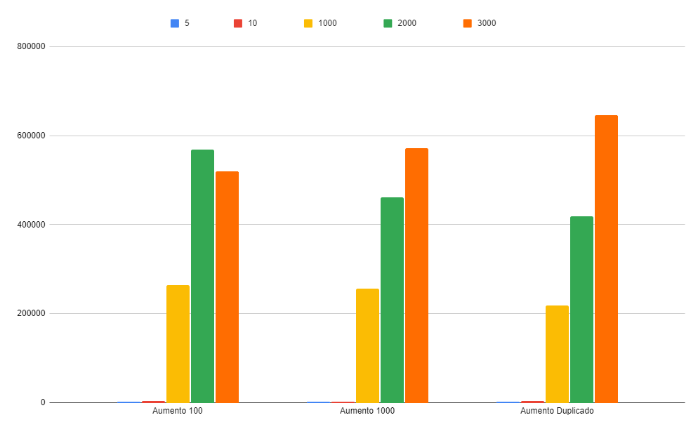

# Projeto de Algoritmos
> O objetivo desse projeto é implementar biblioteca de classes para manipulação de um vetor dinâmico de números inteiros. Sendo elas duas classes distintas, uma implementada com alocação dinâmica de arrays, realocando mais memória, quando necessário, e outra implementada com lista duplamente ligada.

Tópicos presente neste documento:
 1. [Estrutura do projeto](#struct)
 2. [Estrutura do Projeto ](#struct)
 3. [Resultado dos testes realizados](#result)
 4. [Como realizar testes](#tests)
 5. [Desempenho](#performance)

*******
<div id='struct'/>  

## Estrutura do projeto:  
O projeto está separado em dois diretórios de classes diferentes: ArrayList baseado em arrays dinâmicos e LinkedList baseado em nós interligados. O ArrayList possui três formas distintas de aumento de array implementadas:

1. Capacidade inicial de 100 (cem) e aumento de 100 cada vez que precisar de mais -> "array_list1.hpp" e "linked_list1.hpp"
2. Capacidade inicial de 1000 (mil) e aumento de 1000 cada vez que precisar de mais -> "array_list2.hpp" e "linked_list2.hpp"
3. Capacidade inicial de 8 (oito) e aumento de duplica cada vez que precisar de mais -> "array_list3.hpp" e "linked_list3.hpp"

Dentro de cada diretório está localizado os casos testes utilizados, pastas contendo o arquivo-main utilizado para o teste de cada método implementado, assim como também um arquivo.txt contendo o resultado dos testes realizados.
Seguindo a seguinte organização:


``` php
    ArrayList/
    |__ tests-nome-do-método
        |__ test-nome-do-método-array-list-01.cpp
        |__ test-nome-do-método-array-list-02.cpp
        |__ test-nome-do-método-array-list-03.cpp
        |__ resultado-tests.txt
    |__ tests
    |__ array_list1.hpp
    |__ array_list2.hpp
    |__ array_list3.hpp

    LinkedList/
    |__ tests-nome-do-método
        |__ test-nome-do-método-linked-list-01.cpp
        |__ resultado-tests.txt
    |__ tests
    |__ linked_list1.hpp
  
```
*******
<div id='result'/>  

## Resultado dos testes realizados:

O resultado dos testes relizados para averiguar o funcionamento correto dos métodos estão localizados no diretório de teste das distintas implementações, nomeado como resultado-tests.txt.
Sendo estruturado de acordo com o tipo de capacidade de classe utilizada.

*******
<div id='tests'/>  

## Como realizar testes: 

-> Baixar o arquivo contendo todos os diretórios; </br>
-> Abrir o diretório raiz da classe que deseja executa (ArrayList ou LinkedList):
``` cpp
cd ArrayList
```
-> Compilar: 
``` cpp
g++ -Wall -o programa nome-da-pasta-do-arquivo/nome-do-arquivo -I.
./programa < Casos-testes/nome-da-pasta-de-teste/e1.txt >> nome-do-arquivo-que-deseja-salvar.txt 2>&1
```
Exemplo:
``` cpp
g++ -Wall -o programa test-pop-front/test-popfront-array-list-01.cpp -I.
./programa < tests/remove/e1.txt >> test-pop-front/resultado-tests02.txt 2>&1
```
-> O resultado do teste será encaminhado para o resultado-tests02.txt que será criada ao compilar os arquivos, mostrando as informações sobre o return do método e o tempo de execução;

*******
<div id='performance'/>  

## Desempenho: 
O gráfico a seguir representa o desempenho e o tempo de execução das três formas distintas de aumento de array implementadas. O método Push-Back foi a implementação escolhida como parâmetro para essa análise por ser o método principal utilizado para incrementar os vetores nas classes de testes dos métodos:

### ArrayList
</br>
A respeito de mudanças mínimas do tamanho de entrada como 5 e 10 (coluna azul e vermelha respectivamente), notasse uma diferença básica de tempo de execução. Já em relação a mudanças acima de 1000, é notório uma diferença mais abrangente. Observando assim, que o método de duplicar a capacidade se mostra melhor em relação a tempo de execução e desempenho em relação as implementações.
Outro ponto acerca do aumento da capacidade da Array list é no método percent-occupied, onde nos testes realizados foi possível visualizar que a ocupação é mínima quando utilizado o método de duplicar a capacidade da array para aumento de capacidade. <\br>
Comparando o ArrayList e LinkedList, é possível que alguns métodos aparentam ser mais velozes utilizando LinkedList em vez de ArrayList, métodos como inserir ao ínicio do array e em indices específicos. Já os de busca por índices se tornam mais vantajosos utilizando o ArrayList.

### LinkedList


